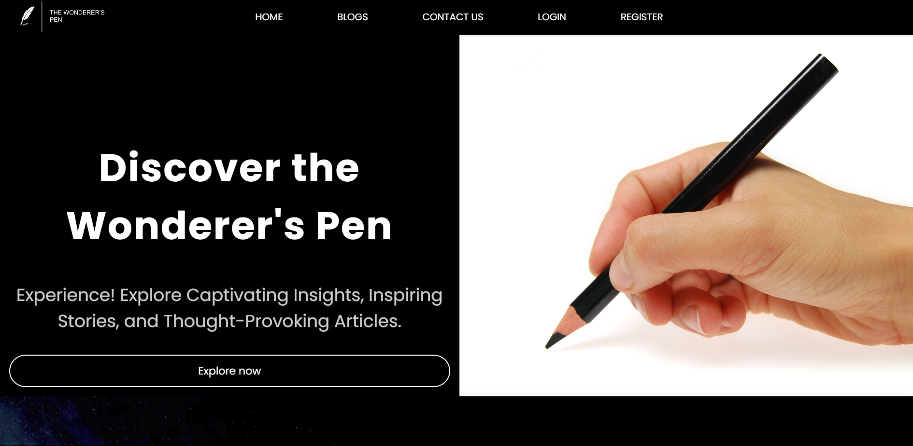
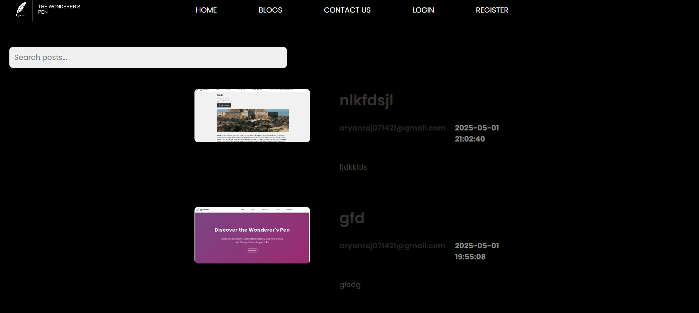
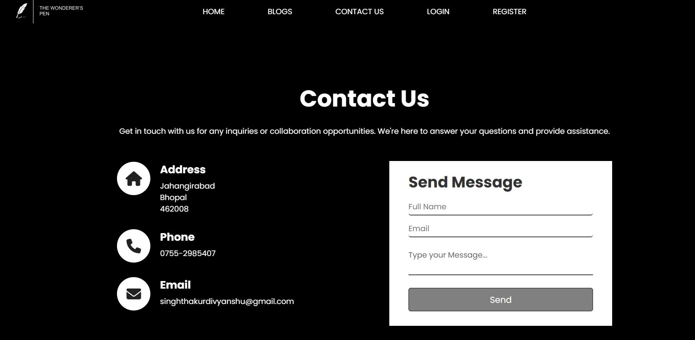
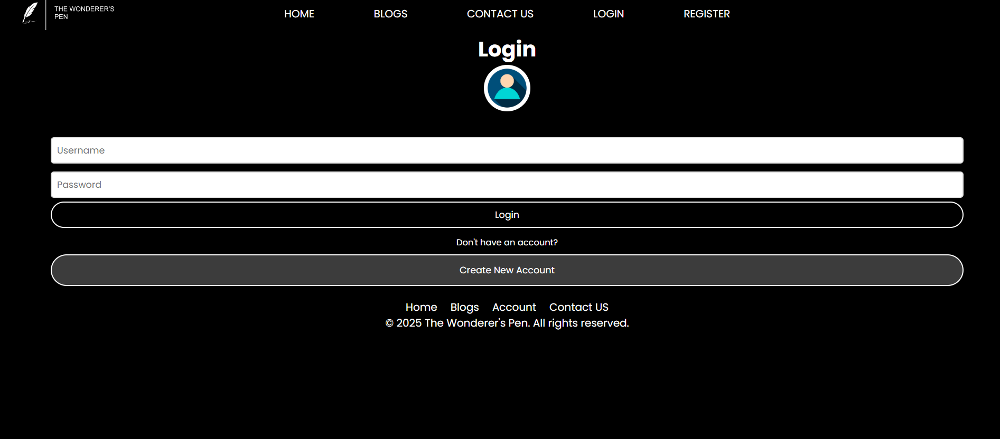
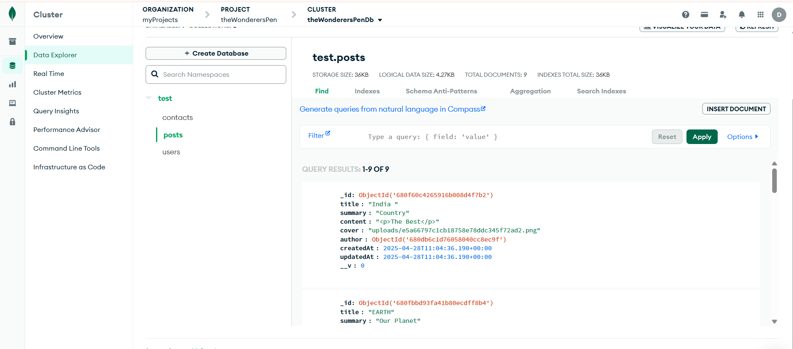
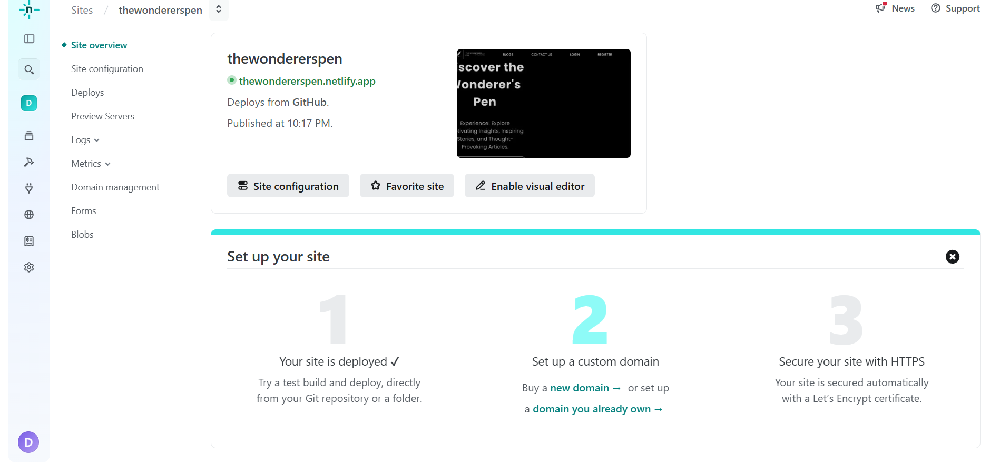
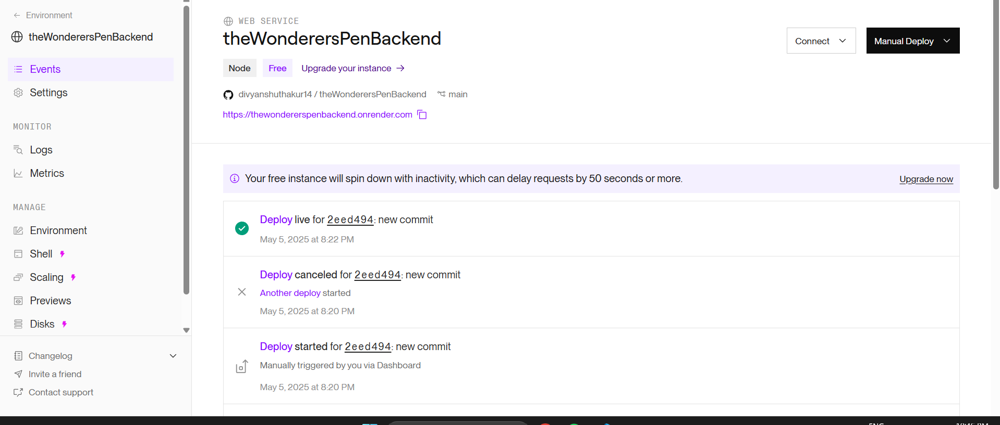

# theWonderersPen
## Table of Contents
- [Introduction](#introduction)
- [Key Features](#-key-features)
- [Technologies Used](#technologies-used)
- [File Structure](#file-structure)
- [Installation Guide](#installation-guide)
- [Contribution](#contribution)
- [Contact](#contact)
- [ScreenShots](#screenshots)

## Introduction
Welcome to the Wonderer's Pen, a dynamic mern stack highly responsive web application for seamless creation and viewing of blogs, for the ones who are in love with the beauty of creative writing. Whether you're an avid writer or an enthusiastic reader, Blogosphere is tailored to meet your blogging needs with style and functionality.

## Key Features
🔑 **User Authentication & Authorization:** The website prioritizes the security and privacy of its users. We've implemented robust authentication and authorization mechanisms using JWT, Bcryptjs, and secure cookies. Your data is safe, and you can enjoy a seamless experience without compromising on security.

📝 **Blog Operations:** Express your thoughts and creativity effortlessly! With the Wonderer's Pen, users can create and edit their blogs with an intuitive and dynamic content creation interface. Write, edit, and personalize your content to make it uniquely yours.

📧 **Contact Us Page:** Communication is key! The website features a Contact Us page seamlessly integrated with MongoDb Cloud Atlas. Reach out to us easily, ask questions, provide feedback, or just say hello. We value your input and are committed to fostering a strong community.

🏠 **Landing Page:** Your journey begins with a captivating landing page designed to leave a lasting impression. Our landing page is crafted to engage visitors and provide a glimpse into the rich content that awaits them within the app. Welcome to a world where every visit starts on a positive note!

📱 **Mobile Responsiveness:** The Wonderer's Pen is not confined to desktops; it accompanies you wherever you go. Experience the same level of smooth navigation and functionality on various devices, ensuring that the website is accessible anytime, anywhere. Whether you're on your laptop, tablet, or smartphone, your blogging journey is at your fingertips.

## Technology Stack
- **MongoDB Cloud Atlas:** For a flexible and scalable database to handle blog data efficiently.
- **Express.js:** For building a robust and scalable backend to manage blog operations.
- **React.js:** For creating a dynamic and interactive user interface.
- **Node.js:** For running the server-side logic and handling backend requests.
- **JWT, Bcryptjs, Cookies:** Ensuring secure user authentication and authorization.
- **Netlify:** For deploying the frontend client part of the website.
- **Render:** For deploying the backend server part of the website.

## File Structure
Frontend

```
└── 📁client
    └── .gitignore
    └── package-lock.json
    └── package.json
    └── 📁public
        └── _redirects
        └── folder-structure.md
        └── index.html
        └── manifest.json
        └── robots.txt
        └── The Wonderer's Pen.png
        └── The Wonderer's Pen2.png
    └── 📁src
        └── App.js
        └── 📁css
            └── about.css
            └── App.css
            └── brief.css
            └── buying.css
            └── contact.css
            └── footer.css
            └── forms.css
            └── home.css
            └── index.css
            └── navbar.css
            └── takeproduct.css
            └── testimonial.css
            └── whybuy.css
        └── index.js
        └── 📁pages
            └── BlogsPage.js
            └── Contact.jsx
            └── CreatePost.js
            └── EditPost.js
            └── IndexPage.jsx
            └── LoginPage.js
            └── PostPage.js
            └── RegisterPage.js
        └── 📁partials
            └── Footer.js
            └── Layout.js
            └── NavBar.js
            └── Post.js
        └── 📁utils
            └── Editor.js
            └── UserContext.js
```

Backend

```
└── 📁server
    └── 📁middleware
        └── multer.js
    └── 📁utils
        └── cloudinary.js
    └── .gitignore
    └── folder-structure2.md
    └── package.json
    └── package-lock.json
    └── index.js
    └── 📁models
        └── Contact.js
        └── Post.js
        └── User.js
```

## Installation Guide

🚀 Follow these steps to install and run the Awesome Project:
#### A. Client (Frontend) Installation:

1. **Navigate to the client folder:**

   ```bash
   cd client
   ```

2. **Install Frontend Dependencies:**

   ```bash
   npm install
   ```

3. **Configure Environment Variables:**

   - Rename the `.env.example` file to `.env`.
   - Open the `.env` file and add your server API base link:
     ```env
     REACT_APP_API_BASE_URL=http://your-server-api-link
     ```

4. **Start the Development Server:**
   ```bash
   npm start
   ```
   This will launch the client application on `http://localhost:3000`.

   #### B. Server (Backend) Installation:

1. **Navigate to the server folder:**

   ```bash
   cd server
   ```

2. **Install Backend Dependencies:**

   ```bash
   npm install
   ```

3. **Configure Environment Variables:**

   - Rename the `.env.example` file to `.env`.
   - Open the `.env` file and add your MongoDB URI and JWT secret:
     ```env
     MONGO_URI=mongodb://your-mongo-uri
     JWT_SECRET=your-jwt-secret
     ```

4. **Run the Server for Development:**
  ```bash
   npm run dev
   ```

   This will start the server in development mode.

5. **Run the Server for Production:**
   ```bash
   npm start
   ```
   Use this command when deploying the server in a production environment.

Now, both the client and server are installed and running. You can access the frontend on `http://localhost:3000`, and the backend will be running according to your specified configuration (by default on `http://localhost:4000`).

An easy way is to just let everything be the same, running it on my mongodb, netlify and render profile using - https://thewondererspen.netlify.app

## Contribution

1. Fork the repository.
2. Create a new branch: `git checkout -b feature/new-feature`
3. Make your changes and commit them: `git commit -m 'Add new feature'`
4. Push to the branch: `git push origin feature/new-feature`
5. Submit a pull request.

## Contact 

📬 Feel free to reach out to me on social media:
- Email: singhthakurdivyanshu@gmail.com

  ## Screenshots
  
  
  
  
  
  
  


